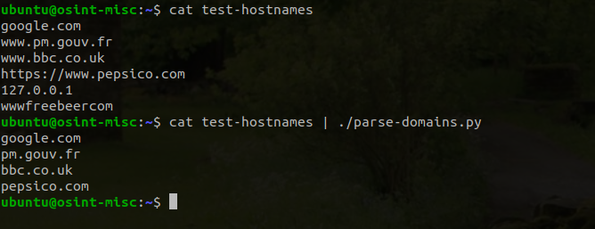

# parse-domains
Python script to extract first level domains using 'tld' library. 

```

  #!/usr/bin/python3
 
  import fileinput #handles file as argument, STDIN or via pipeline
  from tld import get_fld

  contents = fileinput.input()
  for line in contents:
     domain = get_fld(line, fix_protocol=True, fail_silently=True)
     #fix_protocol, allows “protocol://” prefix. 
     #fail_silently, supress errors if no domain detected (Ips, ...)
     if domain: print(domain) #Strip null/invalid responses

```
It takes input from the pipeline, via a filename or via STDIN. 

```

$ cat someURLS | ./parse-domains.py

$ ./parse-domains.py file-with-URLs.txt

$ ./parse-domains < file-with-URLs.txt

```



It takes one line of URL, FQDN, whatever, and spits out the first level domain, or says nothing. Or terrible things happen.

